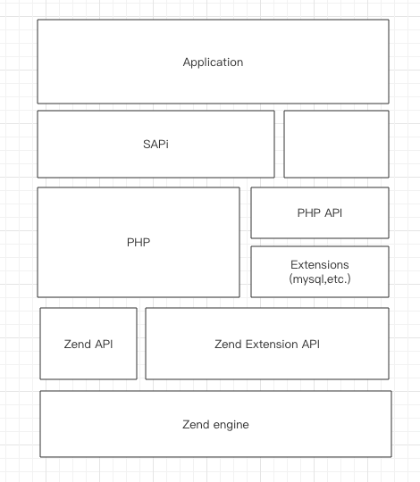
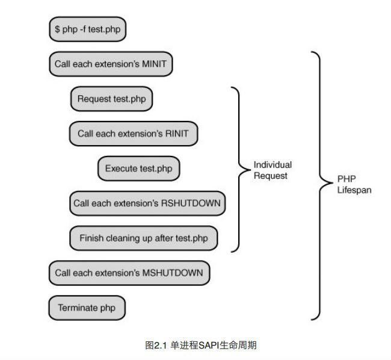
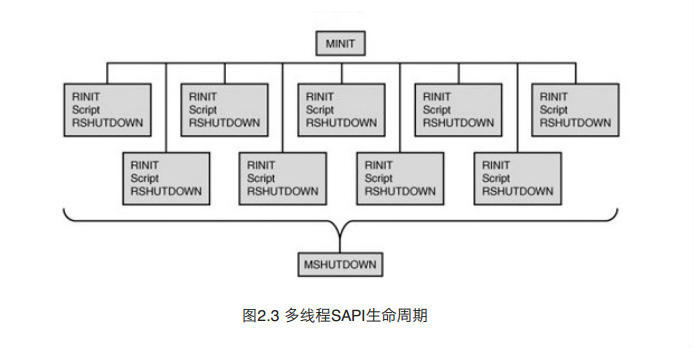

# PHP 生命周期

## PHP设计理念及特点

- 多进程模型：由于PHP是多进程模型，不同请求间互不干涉，这样保证了一个请求挂掉不会对全盘服务造成影响。
- 弱类型语言：一个变量的类型并不是一开始就确定不变的，运行中才会确定并可能发生隐式或显示的类型转换。
- 引擎（Zend）+组件（ext）的模式降低内部耦合。
- 中间层（sapi）隔绝web server和PHP。

## PHP体系结构

PHP体系结构

- `SAPI` 全称Server Application Programming Interface，也就是服务端应用编程接口，Sapi通过一系列钩子函数，使得PHP可以和外围交互数据，这是PHP非常优雅和成功的设计，通过sapi成功的将PHP本身和上层应用解耦隔离，PHP可以不再考虑如何针对不同应用进行兼容，而应用本身也可以针对自己的特点实现不同的处理方式。
- `内核`：处理请求、文件流、错误处理等相关操作。
- `扩展层`：一组函数、类库和流。
- `Zend引擎`：将PHP代码翻译成可以执行的opcode的处理以及实现相关的处理方法，实现了基础的数据结构（如：hashtable）,内存分配机制以及管理，同时提供相关的API方法供外部去调用。

## PHP Life Cycle

PHP 生命周期，一切从 SAPI 开始。

### 单进程SAPI生命周期

一个 PHP 进程，在其生命周期内，经历了数个阶段。
`MINIT`：每个模块都依次执行模块初始化。涉及全局变量，常量，INI文件，类。
`RINIT`：当进程开始处理 PHP 请求时，每个模块依次执行请求初始化。涉及请求变量、环境变量。
`Zend Engine`：编译，执行。
`RSHUTDOWN`：当请求处理完毕，每个模块依次执行请求终止。
`Zend Engine`：垃圾收集 - 变量释放。
`MSHUTDOWN`：当 PHP 进程关闭时，与其关联的模块将依次从内存中销毁，即模块关闭。

### 多线程SAPI生命周期
多线程的 SAPI 生命周期，`MINIT` 和 `MSHUTDOWN` 在进程的存活期内，只需要执行一次。

### 详细图解

## PHP 生命周期关键词

1. MINIT（module init 模块初始化）

- 启动 PHP 输出、初始化垃圾回收器
- 启动 Zend 引擎、注册 Zend 核心扩展、Zend 标准常量
- 解析 PHP.ini，映射 PHP.ini 相关配置
- 注册静态、动态编译的扩展
- 回调各扩展定义的 module starup 钩子函数

用一句话来说，就是初始化类、常量、扩展等 PHP 所用到的资源

2. RINIT（request init 请求初始化）

PHP 初始化脚本执行的基本环境，SAPI 将控制权交给 PHP，激活 Zend 引擎，初始化执行器

3. PHP 脚本执行

Zend 引擎接管控制权，将 PHP 脚本编译成 Opcodes，并顺序执行

4. RSHUTDOWN (request shutdown 请求结束)

PHP 脚本执行完之后进入请求结束阶段，PHP 启动清理程序，这个阶段，将 flush 输出内容，发送 http 响应内容，关闭 PHP 执行器

5. MSHUTDOWN(module shutdown 模块关闭)

这个阶段主要是进行资源的清理、php 各模块的关闭操作，同时，将回调各扩展的 module shutdown 钩子函数
