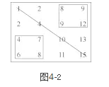
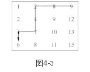

# 杨氏矩阵的查找
行列递增矩阵(杨氏矩阵)的查找、在m*n列数组

有一个二维数组. 数组的每行从左到右是递增的，每列从上到下是递增的. 在这样的数组中查找一个数字是否存在。杨氏矩阵说白了，杨氏矩阵就是一个二维数组，不过这个二维数组有点特别：数组的每行从左到右是递增的，每列从上到下是递增的。

## 解法一：分治法

以查找数6为例，因为矩阵的行和列都是递增的，所以整个矩阵的对角线上的数也是递增的，故可以在对角线上进行二分查找：如果要找的数的大小介于对角线上相邻的两个数之间，则可以排除掉左上和右下的两个小矩阵，而在左下和右上的两个小矩阵内继续递归查找，如图4-2所示。

## 解法二：定位法

如图4-3，首先直接定位到矩阵中最右上角的元素，如果这个元素比要找的数6大就往左走，比要找的数6小就往下走，直到找到要找的数6为止。这个方法的时间复杂度是O(m +n)。

